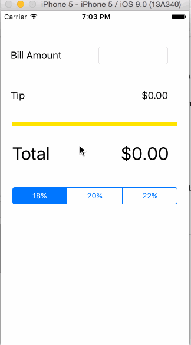

# Pre-work Tip Calculator for Codepath

This application is an exercise to complete the application to Codepath's iOS bootcamp. This is done using Xcode 7 and iOS 9.

## What does the app can do?

* [x] Required: The user can calculate the tip, using diferent percentages 

Walkthrough of all the app stories:

